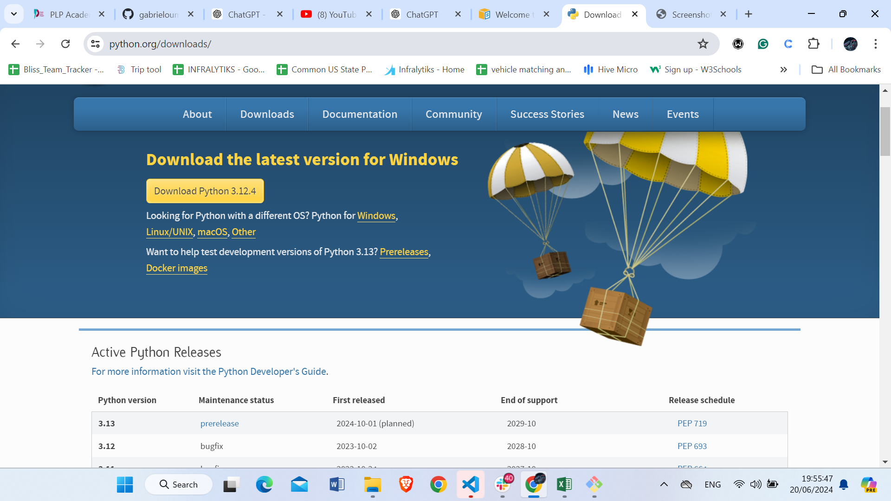
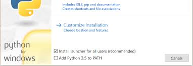

# SE-Assignment-6
 Assignment: Introduction to Python
Instructions:
Answer the following questions based on your understanding of Python programming. Provide detailed explanations and examples where appropriate.

 Questions:

1. Python Basics:
   - What is Python, and what are some of its key features that make it popular among developers? Provide examples of use cases where Python is particularly effective.
 
    Python is a high-level, interpreted programming language known for its readability and simplicity. It supports multiple programming paradigms, including procedural, object-oriented, and functional programming. It is widely used in web applications, software development, data science, and machine learning (ML).

    key features:

    *Readability and Simplicity: Python's syntax is clear and easy to understand, making it ideal for beginners and for rapid development.
    *Python is an interpreted language, which means it directly runs the code line by line. If there are errors in the program code, it will stop running. Therefore, programmers can quickly find errors in the code.
    *Python can be used for a wide range of applications, from web development to scientific computing.
    *Programmers do not have to declare variable types when writing code because Python determines them at runtime. Because of this, you can write Python programs more quickly.

    <b>Use Cases Where Python is Particularly Effective:</b>

      *Web Development: Frameworks like Django and Flask allow for the rapid development of robust web  applications.
      Example: A social media platform or a content management system (CMS).

      *Python scripts can automate repetitive tasks and system administration jobs.for Example: Automating file backups or generating reports from log files.

2. Installing Python:
   - Describe the steps to install Python on your operating system (Windows, macOS, or Linux). Include how to verify the installation and set up a virtual environment.
   
   <b>Here are the steps to install Python on different operating systems (Windows) verify the installation, and set up a virtual environment.</b>

    Windows
    Download Python:

    Go to the official Python website: https://www.python.org/
    Navigate to the Downloads section and select the latest stable version of Python for Windows.
    
    Run the Installer:

    Run the downloaded installer.
    Make sure to check the box that says "Add Python to PATH".
     

    Choose "Install Now" or customize the installation according to your preference.

    Complete Installation:

      The installation process will begin, and you will see a progress bar.
      Once the installation is complete, click "Close".

      Verify the Installation:

      Open Command Prompt or git bash:

      Press Win + R, type cmd, and press Enter.
      Check the Python Version:

    Type "python --version or python -V" and press Enter.

     You should see the installed Python version displayed in the Command Prompt.

    Check the Pip Version:

    Type pip --version and press Enter.

     You should see the installed Pip version displayed in the Command Prompt

    Setting Up a Virtual Environment:

    Navigate to Your Project Directory:

    Use the cd command in the Command Prompt to navigate to your project directory.

    Example: cd path\to\your\project.

     Create a Virtual Environment:

     Type python -m venv venv and press Enter.

      This command creates a virtual environment named venv in your project directory.

     Activate the Virtual Environment:

    Type venv\Scripts\activate and press Enter.

     You should see (venv) at the beginning of the command prompt line, indicating that the virtual environment is activated.

     Deactivate the Virtual Environment:

     To deactivate the virtual environment, type deactivate and press Enter.
     

3. Python Syntax and Semantics:
   - Write a simple Python program that prints "Hello, World!" to the console. Explain the basic syntax elements used in the program.

       # This is a comment in Python. Comments are ignored by the interpreter.
       # They are used to add explanations or notes in the code.

       # Print "Hello, World!" to the console
            print("Hello, World!")
        
      
       Comments (#): Comments in Python provide explanations or notes within the code, enhancing human readability without affecting program execution.

       Print Statement (print("Hello, World!")): The print() function outputs text or variables to the console, making it a fundamental tool for displaying information in Python programs.

       String Literal ("Hello, World!"): Text enclosed in quotes represents string literals, which are used to handle textual data like messages or information in Python programs.

       Whitespace and Indentation: Python uses whitespace and indentation to define the structure of the code, ensuring readability and indicating blocks of code such as loops and functions.

       Execution: Python programs are executed by saving them in files with a .py extension and running them using a Python interpreter, facilitating the execution of code and displaying output results.

4. Data Types and Variables:
   - List and describe the basic data types in Python. Write a short script that demonstrates how to create and use variables of different data types.

      Basic Data Types in Python:

       Integer (int): Represents whole numbers without decimal points.

       Float (float): Represents numbers with decimal points. 
       
       String (str): Represents textual data enclosed within quotes.

       Boolean (bool): Represents True or False values

       # Integer
        x = 10

        print(x, type(x))   
       # Float
        y = 3.14

        print(y, type(y))
      
      # String
      name = "John Doe"

        print(name, type(name))
      # Boolean
      is_student = True

        print(is_student, type(is_student))
      # List
      numbers = [1, 2, 3, 4, 5]

        print(numbers, type(numbers))
      # Tuple
      coordinates = (10, 20) 

         print(coordinates, type(coordinates))

      # Dictionary
      person = {'name': 'Alice', 'age': 30}

        print(person, type(person))
      # Set
      unique_numbers = {1, 2, 3, 4, 5}

        print(unique_numbers, type(unique_numbers))

5. Control Structures:
   - Explain the use of conditional statements and loops in Python. Provide examples of an `if-else` statement and a `for` loop.

   # Conditional Statements (if-else)
  Conditional statements allow you to make decisions in your code based on certain conditions. 

   here is the example:
     # Check if a number is positive or negative
      num = -5

     if num >= 0:

    print("The number is positive.")

     else:

    print("The number is negative.")

    if the variable num is greater than or equal to zero, it prints "The number is positive." Otherwise, it prints "The number is negative."

    # Loops (for Loop)
     Loops are used to iterate over a sequence of elements or execute a block of code repeatedly. 

     here is the example:

     # Print each element of a list
      fruits = ["apple", "banana", "cherry"]

      for fruit in fruits:

      print(fruit)

      In this example, the for loop iterates over each element in the fruits list and prints each element.

6. Functions in Python:
   - What are functions in Python, and why are they useful? Write a Python function that takes two arguments and returns their sum. Include an example of how to call this function.

     Functions in Python are blocks of reusable code that perform a specific task. They are defined using the def keyword followed by the function name, parameters, and a code block. Functions are useful for organizing code, promoting reusability, and improving readability.
    
    # Here's an example of a Python function that takes two arguments and returns their sum: 

       def add_two_numbers(num1, num2):
       return num1 + num2

       result = add_two_numbers(3, 4)
       print(result)  # Output: 7

      def add_numbers(num1, num2): defines a function named add_numbers that takes two arguments, num1 and num2.
      The return num1 + num2 statement returns the sum of num1 and num2. 

      add_numbers(3, 4) calls the add_numbers function with arguments 3 and 4, and the returned value 7 is stored in the variable result and then printed.
    
7. Lists and Dictionaries:
   - Describe the differences between lists and dictionaries in Python. Write a script that creates a list of numbers and a dictionary with some key-value pairs, then demonstrates basic operations on both.

   Lists and Dictionaries are different data structures in Python. Lists are ordered collections of items, whereas the dictionary is an unordered collection of data in a key: value pair form
    # Create a list of numbers
    numbers_list = [1, 2, 3, 4, 5]

# Create a dictionary with key-value pairs
   person = {
    "name": "John Doe",
    "age": 30,
    "city": "New York"
}

# Accessing elements
   print(numbers_list[0])  
   print(person["name"])  

# Updating elements
  numbers_list[2] = 10
  person["age"] = 35

# Adding elements
   numbers_list.append(6)
   person["job"] = "Engineer"

# Removing elements
   numbers_list.remove(4)
   del person["city"]

   print(numbers_list)  
   print(person)  

8. Exception Handling:
   - What is exception handling in Python? Provide an example of how to use `try`, `except`, and `finally` blocks to handle errors in a Python script.
 
  Exception handling in Python is a mechanism to handle runtime errors, allowing a program to continue running despite encountering an error. 

  try block: Contains the code that might raise an exception.

  except block: Catches and handles the exception if it occurs.

  finally block: Contains code that will be executed regardless of whether an exception occurs or not, usually for cleanup actions.
     
     try:
    numerator = 10
    denominator = 0

    result = numerator/denominator

    print(result)
    except:
    print("Error: Denominator cannot be 0.")

    # Output: Error: Denominator cannot be 0. 

9. Modules and Packages:
   - Explain the concepts of modules and packages in Python. How can you import and use a module in your script? Provide an example using the `math` module.
   
      In Python, a module is a file containing Python definitions, functions, and classes. It allows you to organize your code into reusable components. A package is a directory containing multiple modules and subdirectories, creating a hierarchical structure.

      To import a module in your script, you can use the "import" statement followed by the name of the module. 

      # Using the math Module
      The math module is a built-in Python module that provides mathematical functions. To use it, you simply import it in your script.

       Here's an example of how to use the math module:
       from math import *
       
       # Calculate the square root of 16
       result = sqrt(16)

       # Print the result
       print(result)  # Output: 4.0

10. File I/O:
    - How do you read from and write to files in Python? Write a script that reads the content of a file and prints it to the console, and another script that writes a list of strings to a file.
     
      To read from a file in Python, you can use the open() function with the file path and mode ('r' for reading) as arguments. You can then use methods like read(), readline(), or readlines() to read the content of the file. Here's an example script that reads the content of a file and prints it to the console:

      # Reading from a file and printing its content
      file_path = 'example.txt'
      
      with open(file_path, 'r') as file:
          content = file.read()
          print(content)

      To write to a file in Python, you can use the open() function with the file path and mode ('w' for writing) as arguments. You can then use methods like write() to write content to the file. Here's an example script that writes a list of strings to a file:

      # Writing a list of strings to a file
      file_path = 'output.txt'
      strings_list = ["Hello", "World", "Python"]
      
      with open(file_path, 'w') as file:
          for string in strings_list:
              file.write(string + '\n')    

        Here's a script that reads the content of a file and prints it to the console:

            # Script to read from a file and print its content

# Specify the file name
file_name = 'input.txt'

try:
    # Open the file in read mode
    with open(file_name, 'r') as file:
        # Read the content of the file
        content = file.read()
        # Print the content to the console
        print(content)
except FileNotFoundError:
    print(f"The file {file_name} does not exist.")
except Exception as e:
    print(f"An error occurred: {e}")
     
     Here's a script that writes a list of strings to a file:

     #Script to write a list of strings to a file

#List of strings to write to the file
lines = [
    "First line of text",
    "Second line of text",
    "Third line of text"
]

# Specify the file name
file_name = 'output.txt'

try:
    #Open the file in write mode
    with open(file_name, 'w') as file:
        #Write each string in the list to the file
        for line in lines:
            file.write(line + '\n')
    print(f"Successfully written to {file_name}")
except Exception as e:
    print(f"An error occurred: {e}")

    

# Submission Guidelines:
- Your answers should be well-structured, concise, and to the point.
- Provide code snippets or complete scripts where applicable.
- Cite any references or sources you use in your answers.
- Submit your completed assignment by [due date].

